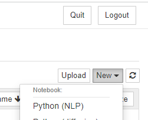
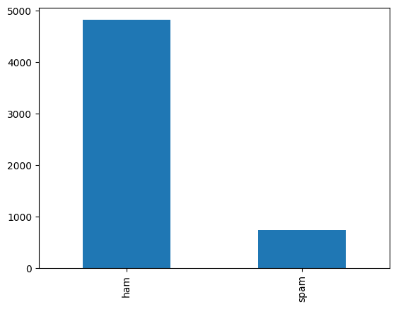
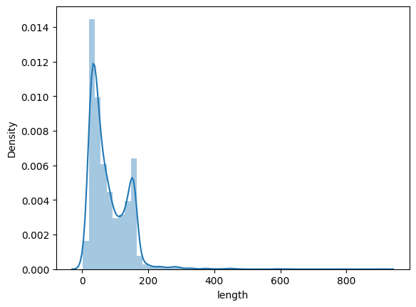
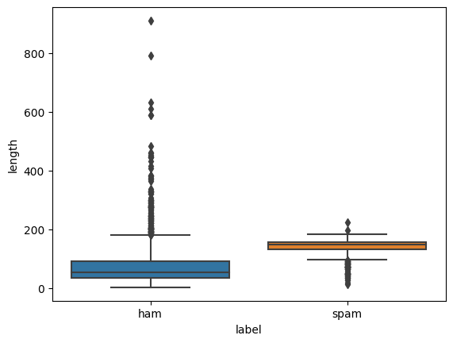
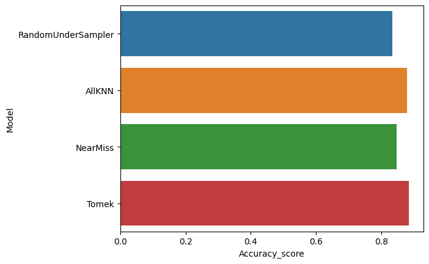

# How to handle imbalanced text data

Hello everyone today we are going to discuss  an interesting problem about imbalanced text data.

I will analyze the **Spam Detection using NLP**.

This example is helpful to show how to deal this type of problems for your custom NLP problems.

## What is Imbalanced Data?

Imbalanced data typically refers to a problem with classification problems where the classes are not represented equally.

There different performance measures that can give more insight into the accuracy of the model than traditional classification accuracy:

- **Confusion Matrix**: A breakdown of predictions into a table showing correct predictions (the diagonal) and the types of incorrect predictions made (what classes incorrect predictions were assigned).
- **Precision**: A measure of a classifiers exactness.
- **Recall**: A measure of a classifiers completeness
- **F1 Score (or F-score)**: A weighted average of precision and recall.

I would also advice you to take a look at the following:

- **Kappa (or [Cohen’s kappa](https://en.wikipedia.org/wiki/Cohen's_kappa))**: Classification accuracy normalized by the imbalance of the classes in the data.
- **ROC Curves**: Like precision and recall, accuracy is divided into sensitivity and specificity and models can be chosen based on the balance thresholds of these values.

## Step 1. Creation of the environment

I will create an environment called **nlp**, because I am interested in  the **Natural Language Processing** (NLP) . 

NLP enables computers to understand natural language as humans do. Whether the language is spoken or written, natural language processing uses artificial intelligence to take real-world input, process it, and make sense of it in a way a computer can understand.

```
conda create -n nlp python==3.8
```

then

```
conda activate nlp
```

then in your terminal type the following commands:

```
conda install ipykernel
```

then we install

```
python -m ipykernel install --user --name nlp --display-name "Python (NLP)"
```

then  we install the following libraries

```
pip install  matplotlib seaborn nltk sklearn plotly wordcloud xgboost imbalanced-learn notebook jupyter
```

then we type 

```
jupyter notebook
```



and we choose our  Python (NLP) notebook.

## Step 2. Load libraries

```python
#importing necessary libraries
# General

import numpy as np
import pandas as pd
import re
import os
import pickle

# EDA

import matplotlib.pyplot as plt
import seaborn as sns 
import plotly.express as px
from wordcloud import WordCloud
from collections import Counter

# NLP 

import nltk
from nltk.corpus import stopwords
from nltk.stem.porter import PorterStemmer
from sklearn.feature_extraction.text import TfidfVectorizer
from nltk.tokenize import word_tokenize 

# ML
from sklearn.pipeline import Pipeline
from sklearn.model_selection import train_test_split
from sklearn.naive_bayes import MultinomialNB
from sklearn.ensemble import RandomForestClassifier
from xgboost import XGBClassifier
from sklearn.svm import SVC
from sklearn.metrics import classification_report, confusion_matrix
```


```python
df=pd.read_csv('spam.csv',encoding = 'latin-1')
df.head()
```


<div>
<style scoped>
    .dataframe tbody tr th:only-of-type {
        vertical-align: middle;
    }


<table border="1" class="dataframe">
  <thead>
    <tr style="text-align: right;">
      <th></th>
      <th>v1</th>
      <th>v2</th>
      <th>Unnamed: 2</th>
      <th>Unnamed: 3</th>
      <th>Unnamed: 4</th>
    </tr>
  </thead>
  <tbody>
    <tr>
      <th>0</th>
      <td>ham</td>
      <td>Go until jurong point, crazy.. Available only ...</td>
      <td>NaN</td>
      <td>NaN</td>
      <td>NaN</td>
    </tr>
    <tr>
      <th>1</th>
      <td>ham</td>
      <td>Ok lar... Joking wif u oni...</td>
      <td>NaN</td>
      <td>NaN</td>
      <td>NaN</td>
    </tr>
    <tr>
      <th>2</th>
      <td>spam</td>
      <td>Free entry in 2 a wkly comp to win FA Cup fina...</td>
      <td>NaN</td>
      <td>NaN</td>
      <td>NaN</td>
    </tr>
    <tr>
      <th>3</th>
      <td>ham</td>
      <td>U dun say so early hor... U c already then say...</td>
      <td>NaN</td>
      <td>NaN</td>
      <td>NaN</td>
    </tr>
    <tr>
      <th>4</th>
      <td>ham</td>
      <td>Nah I don't think he goes to usf, he lives aro...</td>
      <td>NaN</td>
      <td>NaN</td>
      <td>NaN</td>
    </tr>
  </tbody>
</table>

</div>


```python
df['v1'].value_counts(dropna=False).plot(kind='bar')
```


    <AxesSubplot: >


​    

​    


```python
df.info()
```

    <class 'pandas.core.frame.DataFrame'>
    RangeIndex: 5572 entries, 0 to 5571
    Data columns (total 5 columns):
     #   Column      Non-Null Count  Dtype 
    ---  ------      --------------  ----- 
     0   v1          5572 non-null   object
     1   v2          5572 non-null   object
     2   Unnamed: 2  50 non-null     object
     3   Unnamed: 3  12 non-null     object
     4   Unnamed: 4  6 non-null      object
    dtypes: object(5)
    memory usage: 217.8+ KB


```python
df.describe()
```


<table border="1" class="dataframe">
  <thead>
    <tr style="text-align: right;">
      <th></th>
      <th>v1</th>
      <th>v2</th>
      <th>Unnamed: 2</th>
      <th>Unnamed: 3</th>
      <th>Unnamed: 4</th>
    </tr>
  </thead>
  <tbody>
    <tr>
      <th>count</th>
      <td>5572</td>
      <td>5572</td>
      <td>50</td>
      <td>12</td>
      <td>6</td>
    </tr>
    <tr>
      <th>unique</th>
      <td>2</td>
      <td>5169</td>
      <td>43</td>
      <td>10</td>
      <td>5</td>
    </tr>
    <tr>
      <th>top</th>
      <td>ham</td>
      <td>Sorry, I'll call later</td>
      <td>bt not his girlfrnd... G o o d n i g h t . . .@"</td>
      <td>MK17 92H. 450Ppw 16"</td>
      <td>GNT:-)"</td>
    </tr>
    <tr>
      <th>freq</th>
      <td>4825</td>
      <td>30</td>
      <td>3</td>
      <td>2</td>
      <td>2</td>
    </tr>
  </tbody>
</table>

</div>


```python
#checking for null values
df.isnull().sum()
```


    v1               0
    v2               0
    Unnamed: 2    5522
    Unnamed: 3    5560
    Unnamed: 4    5566
    dtype: int64


```python
#dropping the column with more null values
df.drop(['Unnamed: 2','Unnamed: 3','Unnamed: 4'],axis=1,inplace=True)
df.isnull().sum()
```


    v1    0
    v2    0
    dtype: int64


```python
#renaming the columns
df=df.rename({'v1':'label','v2':'text'},axis=1)
df.head()
```


<table border="1" class="dataframe">
  <thead>
    <tr style="text-align: right;">
      <th></th>
      <th>label</th>
      <th>text</th>
    </tr>
  </thead>
  <tbody>
    <tr>
      <th>0</th>
      <td>ham</td>
      <td>Go until jurong point, crazy.. Available only ...</td>
    </tr>
    <tr>
      <th>1</th>
      <td>ham</td>
      <td>Ok lar... Joking wif u oni...</td>
    </tr>
    <tr>
      <th>2</th>
      <td>spam</td>
      <td>Free entry in 2 a wkly comp to win FA Cup fina...</td>
    </tr>
    <tr>
      <th>3</th>
      <td>ham</td>
      <td>U dun say so early hor... U c already then say...</td>
    </tr>
    <tr>
      <th>4</th>
      <td>ham</td>
      <td>Nah I don't think he goes to usf, he lives aro...</td>
    </tr>
  </tbody>
</table>


Calculating the length of each data sample
We will create a new length column that will show the length of each data sample. This new column will help us with preprocessing the data samples.


```python
df['length'] = df['text'].apply(lambda x: len(x))
```


```python
df.head()
```


<table border="1" class="dataframe">
  <thead>
    <tr style="text-align: right;">
      <th></th>
      <th>label</th>
      <th>text</th>
      <th>length</th>
    </tr>
  </thead>
  <tbody>
    <tr>
      <th>0</th>
      <td>ham</td>
      <td>Go until jurong point, crazy.. Available only ...</td>
      <td>111</td>
    </tr>
    <tr>
      <th>1</th>
      <td>ham</td>
      <td>Ok lar... Joking wif u oni...</td>
      <td>29</td>
    </tr>
    <tr>
      <th>2</th>
      <td>spam</td>
      <td>Free entry in 2 a wkly comp to win FA Cup fina...</td>
      <td>155</td>
    </tr>
    <tr>
      <th>3</th>
      <td>ham</td>
      <td>U dun say so early hor... U c already then say...</td>
      <td>49</td>
    </tr>
    <tr>
      <th>4</th>
      <td>ham</td>
      <td>Nah I don't think he goes to usf, he lives aro...</td>
      <td>61</td>
    </tr>
  </tbody>
</table>

</div>


Distribution based on length of words


```python
#analyzing text
df['length']=df['text'].apply(lambda x: len(x))
```


```python
sns.distplot(df['length'], kde=True)
```

    <AxesSubplot: xlabel='length', ylabel='Density'>


​    

​    


```python
sns.boxplot(y='length', x='label', data=df)
```


​    

​    


```python
df.head()
```


<table border="1" class="dataframe">
  <thead>
    <tr style="text-align: right;">
      <th></th>
      <th>label</th>
      <th>text</th>
      <th>length</th>
    </tr>
  </thead>
  <tbody>
    <tr>
      <th>0</th>
      <td>ham</td>
      <td>Go until jurong point, crazy.. Available only ...</td>
      <td>111</td>
    </tr>
    <tr>
      <th>1</th>
      <td>ham</td>
      <td>Ok lar... Joking wif u oni...</td>
      <td>29</td>
    </tr>
    <tr>
      <th>2</th>
      <td>spam</td>
      <td>Free entry in 2 a wkly comp to win FA Cup fina...</td>
      <td>155</td>
    </tr>
    <tr>
      <th>3</th>
      <td>ham</td>
      <td>U dun say so early hor... U c already then say...</td>
      <td>49</td>
    </tr>
    <tr>
      <th>4</th>
      <td>ham</td>
      <td>Nah I don't think he goes to usf, he lives aro...</td>
      <td>61</td>
    </tr>
  </tbody>
</table>

</div>


## Data Preprocessing

NLTK has smaller sub-libraries that perform specific text cleaning tasks. These smaller libraries also have methods for text cleaning.


```python
from nltk.stem import WordNetLemmatizer
from nltk import word_tokenize
import re
nltk.download('punkt')
```


Downloading stop words
We download the English stop words so that the model can identify the stop words in the texts and remove them.


```python
nltk.download('stopwords')
nltk.download('omw-1.4')
```


    True


We will use it to remove all the stop words in the dataset. We will then create custom functions for text cleaning and pass in the imported methods as parameters. To implement the custom functions, we will require Python regular expression (RegEx) module.


```python
def convert_to_lower(text):
    return text.lower()
def remove_numbers(text):
    number_pattern = r'\d+'
    without_number = re.sub(pattern=number_pattern, repl=" ", string=text)
    return without_number

import string
def remove_punctuation(text):
    return text.translate(str.maketrans('', '', string.punctuation))

def remove_stopwords(text):
    removed = []
    stop_words = list(stopwords.words("english"))
    tokens = word_tokenize(text)
    for i in range(len(tokens)):
        if tokens[i] not in stop_words:
            removed.append(tokens[i])
    return " ".join(removed)
def remove_extra_white_spaces(text):
    single_char_pattern = r'\s+[a-zA-Z]\s+'
    without_sc = re.sub(pattern=single_char_pattern, repl=" ", string=text)
    return without_sc
def lemmatizing(text):
    lemmatizer = WordNetLemmatizer()
    tokens = word_tokenize(text)
    for i in range(len(tokens)):
        lemma_word = lemmatizer.lemmatize(tokens[i])
        tokens[i] = lemma_word
    return " ".join(tokens)


```


```python
df['text_clean'] = df['text'].apply(lambda x: convert_to_lower(x))
```


```python
df['text_clean'] = df['text_clean'].apply(lambda x: remove_numbers(x))
```


```python
df['text_clean'] = df['text_clean'].apply(lambda x: remove_punctuation(x))
```


```python
df['text_clean'] = df['text_clean'].apply(lambda x: remove_stopwords(x))
```


```python
df['text_clean'] = df['text_clean'].apply(lambda x: remove_extra_white_spaces(x))
```


```python
df['text_clean'] = df['text_clean'].apply(lambda x: lemmatizing(x))
```


```python
df['length_after_cleaning'] = df['text_clean'].apply(lambda x: len(x))

```


```python
df.head()
```


</style>

<table border="1" class="dataframe">
  <thead>
    <tr style="text-align: right;">
      <th></th>
      <th>label</th>
      <th>text</th>
      <th>length</th>
      <th>text_clean</th>
      <th>length_after_cleaning</th>
    </tr>
  </thead>
  <tbody>
    <tr>
      <th>0</th>
      <td>ham</td>
      <td>Go until jurong point, crazy.. Available only ...</td>
      <td>111</td>
      <td>go jurong point crazy available bugis great wo...</td>
      <td>78</td>
    </tr>
    <tr>
      <th>1</th>
      <td>ham</td>
      <td>Ok lar... Joking wif u oni...</td>
      <td>29</td>
      <td>ok lar joking wif oni</td>
      <td>21</td>
    </tr>
    <tr>
      <th>2</th>
      <td>spam</td>
      <td>Free entry in 2 a wkly comp to win FA Cup fina...</td>
      <td>155</td>
      <td>free entry wkly comp win fa cup final tkts st ...</td>
      <td>101</td>
    </tr>
    <tr>
      <th>3</th>
      <td>ham</td>
      <td>U dun say so early hor... U c already then say...</td>
      <td>49</td>
      <td>u dun say early hor c already say</td>
      <td>33</td>
    </tr>
    <tr>
      <th>4</th>
      <td>ham</td>
      <td>Nah I don't think he goes to usf, he lives aro...</td>
      <td>61</td>
      <td>nah dont think go usf life around though</td>
      <td>40</td>
    </tr>
  </tbody>
</table>

</div>


```python
def get_corpus(df):
    corpus = []
    ps = PorterStemmer()
    for i in range(len(df)):
        msg = re.sub('[^a-zA-Z]', ' ', df['text'][i]) #removing non alphabetics
        msg = msg.lower()#lowering the case
        msg = msg.split()
        msg = [ps.stem(word) for word in msg if not word in stopwords.words('english')] # Stemming & Stopwords Removal
        msg = ' '.join(msg)
        corpus.append(msg)
    return corpus
```


```python
corpus=get_corpus(df)
```


```python
#adding new column
df['corpus'] = corpus
df.head()
```


<div>
<style scoped>
    .dataframe tbody tr th:only-of-type {
        vertical-align: middle;
    }


</style>

<table border="1" class="dataframe">
  <thead>
    <tr style="text-align: right;">
      <th></th>
      <th>label</th>
      <th>text</th>
      <th>length</th>
      <th>text_clean</th>
      <th>length_after_cleaning</th>
      <th>corpus</th>
    </tr>
  </thead>
  <tbody>
    <tr>
      <th>0</th>
      <td>ham</td>
      <td>Go until jurong point, crazy.. Available only ...</td>
      <td>111</td>
      <td>go jurong point crazy available bugis great wo...</td>
      <td>78</td>
      <td>go jurong point crazi avail bugi n great world...</td>
    </tr>
    <tr>
      <th>1</th>
      <td>ham</td>
      <td>Ok lar... Joking wif u oni...</td>
      <td>29</td>
      <td>ok lar joking wif oni</td>
      <td>21</td>
      <td>ok lar joke wif u oni</td>
    </tr>
    <tr>
      <th>2</th>
      <td>spam</td>
      <td>Free entry in 2 a wkly comp to win FA Cup fina...</td>
      <td>155</td>
      <td>free entry wkly comp win fa cup final tkts st ...</td>
      <td>101</td>
      <td>free entri wkli comp win fa cup final tkt st m...</td>
    </tr>
    <tr>
      <th>3</th>
      <td>ham</td>
      <td>U dun say so early hor... U c already then say...</td>
      <td>49</td>
      <td>u dun say early hor c already say</td>
      <td>33</td>
      <td>u dun say earli hor u c alreadi say</td>
    </tr>
    <tr>
      <th>4</th>
      <td>ham</td>
      <td>Nah I don't think he goes to usf, he lives aro...</td>
      <td>61</td>
      <td>nah dont think go usf life around though</td>
      <td>40</td>
      <td>nah think goe usf live around though</td>
    </tr>
  </tbody>
</table>

</div>


```python
wordcloud =False
if wordcloud:
    plt.figure(figsize = (24, 6))
    wc = WordCloud(min_font_size = 10, background_color = 'lightblue')
    spam_wc = wc.generate(df[df['label'] == 'spam']['corpus'].str.cat(sep = " "))
    plt.xticks([])
    plt.yticks([])
    plt.imshow(spam_wc)
    
    plt.figure(figsize = (24, 6))
    wc = WordCloud(min_font_size = 10, background_color = 'lightblue')
    ham_wc = wc.generate(df[df['label'] == 'ham']['corpus'].str.cat(sep = " "))
    plt.xticks([])
    plt.yticks([])
    plt.imshow(ham_wc);

```


```python
#transform the values of the output variable into 0 and 1
#We can create the label map as follows:
label_map = {
    'ham': 0,
    'spam': 1,
}
df['label'] = df['label'].map(label_map)
```

## Implementing text vectorization

It converts the raw text into a format the NLP model can understand and use. Vectorization will create a numerical representation of the text strings called a sparse matrix or word vectors. The model works with numbers and not raw text. We will use TfidfVectorizer to create the sparse matrix.


```python
from sklearn.feature_extraction.text import TfidfVectorizer
import numpy as np
tf_wb= TfidfVectorizer()
X_tf = tf_wb.fit_transform(df['text_clean'])
#Converting the sparse matrix into an array
#We then apply the toarray function to convert the sparse matrix into an array.
X_tf = X_tf.toarray()
```


```python
X_tf.shape
X_train_tf, X_test_tf, y_train_tf, y_test_tf = train_test_split(X_tf, df['label'].values, test_size=0.3)
from sklearn.naive_bayes import GaussianNB
NB = GaussianNB()
NB.fit(X_train_tf, y_train_tf)
NB_pred= NB.predict(X_test_tf)
print(NB_pred)
from sklearn.metrics import accuracy_score
print(accuracy_score(y_test_tf, NB_pred))
```

    [0 0 0 ... 0 0 0]
    0.8767942583732058


```python
from imblearn.over_sampling import RandomOverSampler
```

We will use the RandomOverSampler function to balance the classes.

RandomOverSampler will increase the data samples in the minority class (spam). It makes the minority class have the same data samples as the majority class (ham). The function synthesizes new dummy data samples in the minority class to enable class balancing.


```python
X_train, X_test, y_train, y_test = train_test_split(df['text_clean'], df['label'].values, test_size=0.30)
```

After splitting the dataset, we will use the Counter module to check the number of data samples in the majority and minority classes. We import the module as follows:


```python
from collections import Counter
```


```python
Counter(y_train)
```


    Counter({0: 3391, 1: 509})


```python
#Vectorizing the X_train
vectorizer = TfidfVectorizer()
vectorizer.fit(X_train)
```


<style>#sk-container-id-1 {color: black;background-color: white;}#sk-container-id-1 pre{padding: 0;}#sk-container-id-1 div.sk-toggleable {background-color: white;}#sk-container-id-1 label.sk-toggleable__label {cursor: pointer;display: block;width: 100%;margin-bottom: 0;padding: 0.3em;box-sizing: border-box;text-align: center;}#sk-container-id-1 label.sk-toggleable__label-arrow:before {content: "▸";float: left;margin-right: 0.25em;color: #696969;}#sk-container-id-1 label.sk-toggleable__label-arrow:hover:before {color: black;}#sk-container-id-1 div.sk-estimator:hover label.sk-toggleable__label-arrow:before {color: black;}#sk-container-id-1 div.sk-toggleable__content {max-height: 0;max-width: 0;overflow: hidden;text-align: left;background-color: #f0f8ff;}#sk-container-id-1 div.sk-toggleable__content pre {margin: 0.2em;color: black;border-radius: 0.25em;background-color: #f0f8ff;}#sk-container-id-1 input.sk-toggleable__control:checked~div.sk-toggleable__content {max-height: 200px;max-width: 100%;overflow: auto;}#sk-container-id-1 input.sk-toggleable__control:checked~label.sk-toggleable__label-arrow:before {content: "▾";}#sk-container-id-1 div.sk-estimator input.sk-toggleable__control:checked~label.sk-toggleable__label {background-color: #d4ebff;}#sk-container-id-1 div.sk-label input.sk-toggleable__control:checked~label.sk-toggleable__label {background-color: #d4ebff;}#sk-container-id-1 input.sk-hidden--visually {border: 0;clip: rect(1px 1px 1px 1px);clip: rect(1px, 1px, 1px, 1px);height: 1px;margin: -1px;overflow: hidden;padding: 0;position: absolute;width: 1px;}#sk-container-id-1 div.sk-estimator {font-family: monospace;background-color: #f0f8ff;border: 1px dotted black;border-radius: 0.25em;box-sizing: border-box;margin-bottom: 0.5em;}#sk-container-id-1 div.sk-estimator:hover {background-color: #d4ebff;}#sk-container-id-1 div.sk-parallel-item::after {content: "";width: 100%;border-bottom: 1px solid gray;flex-grow: 1;}#sk-container-id-1 div.sk-label:hover label.sk-toggleable__label {background-color: #d4ebff;}#sk-container-id-1 div.sk-serial::before {content: "";position: absolute;border-left: 1px solid gray;box-sizing: border-box;top: 0;bottom: 0;left: 50%;z-index: 0;}#sk-container-id-1 div.sk-serial {display: flex;flex-direction: column;align-items: center;background-color: white;padding-right: 0.2em;padding-left: 0.2em;position: relative;}#sk-container-id-1 div.sk-item {position: relative;z-index: 1;}#sk-container-id-1 div.sk-parallel {display: flex;align-items: stretch;justify-content: center;background-color: white;position: relative;}#sk-container-id-1 div.sk-item::before, #sk-container-id-1 div.sk-parallel-item::before {content: "";position: absolute;border-left: 1px solid gray;box-sizing: border-box;top: 0;bottom: 0;left: 50%;z-index: -1;}#sk-container-id-1 div.sk-parallel-item {display: flex;flex-direction: column;z-index: 1;position: relative;background-color: white;}#sk-container-id-1 div.sk-parallel-item:first-child::after {align-self: flex-end;width: 50%;}#sk-container-id-1 div.sk-parallel-item:last-child::after {align-self: flex-start;width: 50%;}#sk-container-id-1 div.sk-parallel-item:only-child::after {width: 0;}#sk-container-id-1 div.sk-dashed-wrapped {border: 1px dashed gray;margin: 0 0.4em 0.5em 0.4em;box-sizing: border-box;padding-bottom: 0.4em;background-color: white;}#sk-container-id-1 div.sk-label label {font-family: monospace;font-weight: bold;display: inline-block;line-height: 1.2em;}#sk-container-id-1 div.sk-label-container {text-align: center;}#sk-container-id-1 div.sk-container {/* jupyter's `normalize.less` sets `[hidden] { display: none; }` but bootstrap.min.css set `[hidden] { display: none !important; }` so we also need the `!important` here to be able to override the default hidden behavior on the sphinx rendered scikit-learn.org. See: https://github.com/scikit-learn/scikit-learn/issues/21755 */display: inline-block !important;position: relative;}#sk-container-id-1 div.sk-text-repr-fallback {display: none;}</style><div id="sk-container-id-1" class="sk-top-container"><div class="sk-text-repr-fallback"><pre>TfidfVectorizer()</pre><b>In a Jupyter environment, please rerun this cell to show the HTML representation or trust the notebook. <br />On GitHub, the HTML representation is unable to render, please try loading this page with nbviewer.org.</b></div><div class="sk-container" hidden><div class="sk-item"><div class="sk-estimator sk-toggleable"><input class="sk-toggleable__control sk-hidden--visually" id="sk-estimator-id-1" type="checkbox" checked><label for="sk-estimator-id-1" class="sk-toggleable__label sk-toggleable__label-arrow">TfidfVectorizer</label><div class="sk-toggleable__content"><pre>TfidfVectorizer()</pre></div></div></div></div></div>


The fit function will fit the initialized TfidfVectorizer function to the X_train. We then use the transform function to apply the vectorization method.


```python
X_train_tf = vectorizer.transform(X_train)
```

We finally convert the transformed text (sparse matrix) to an array as follows:


```python
X_train_tf = X_train_tf.toarray()
```


```python
#Vectorizing the X_test
X_test_tf = vectorizer.transform(X_test)
X_test_tf = X_test_tf.toarray()
```

Let’s now apply the RandomOverSampler function.

Applying RandomOverSampler function
We use the following code:


```python
ROS = RandomOverSampler(sampling_strategy=1)
```

The function uses the sampling_strategy parameter to balance the class. We set the parameter’s value to 1 to ensure the dataset classes have 1:1 data samples. We then apply the function to the training set. It will generate the new data samples to ensure both classes are balance


```python
X_train_ros, y_train_ros = ROS.fit_resample(X_train_tf, y_train)
```

Let’s recheck the number of data samples in the majority and minority classes:


```python
Counter(y_train_ros)
```


    Counter({0: 3391, 1: 3391})


Using the balanced dataset to build the same model


```python
nb = GaussianNB()
nb.fit(X_train_ros, y_train_ros)
y_preds = nb.predict(X_test_tf)
print(y_preds)
```

    [0 0 1 ... 0 0 0]


```python
print(accuracy_score(y_test, y_preds))
```

    0.8851674641148325


Actually NLP is one of the most common areas in which resampling of data is needed as there are many text classification tasks dealing with imbalanced problem (think of spam filtering, insulting comment detection, article classification, etc.

# Oversampling


```python
X_tf.shape
```


    (5572, 7858)


```python
from imblearn.over_sampling import SMOTE, KMeansSMOTE , ADASYN,SVMSMOTE,KMeansSMOTE,BorderlineSMOTE
from imblearn.combine import SMOTEENN, SMOTETomek
from imblearn.metrics import classification_report_imbalanced
```


```python
def run_model(X,y,model):
    X_train, X_test, y_train, y_test = train_test_split(X, y, test_size=0.30)
    print(Counter(y_train))
    vectorizer_smote = TfidfVectorizer()
    vectorizer_smote.fit(X_train)
    #Vectorizing the X_train
    X_train_vec = vectorizer_smote.transform(X_train)
    X_train_vec = X_train_vec.toarray()
    #Vectorizing the X_test
    X_test_vec = vectorizer_smote.transform(X_test)
    X_test_vec = X_test_vec.toarray()
    # transform the dataset
    oversample = model
    X_train_over, y_train_over = oversample.fit_resample(X_train_vec, y_train)
    print(Counter(y_train_over))
    nb = GaussianNB()
    nb.fit(X_train_over, y_train_over)
    y_preds = nb.predict(X_test_vec)
    score = accuracy_score(y_test,y_preds)
    print("Accuracy: ",score)
    #target_names = ['class 0', 'class 1'] 
    #print(classification_report_imbalanced(y_test, y_preds,     target_names=target_names))
    return score
```


```python
X=df['text_clean']
y=df['label'].values
```


```python
#Object to over-sample the minority class(es) by picking samples at random with replacement. 
oversample= RandomOverSampler(sampling_strategy=1)
ov1=run_model(X,y,model=oversample)
```

    Counter({0: 3353, 1: 547})
    Counter({0: 3353, 1: 3353})
    Accuracy:  0.8839712918660287


```python
# over-sampling using SMOTE.
oversample=SMOTE(sampling_strategy=0.2)
ov2=run_model(X,y,model=oversample)
```

    Counter({0: 3389, 1: 511})
    Counter({0: 3389, 1: 677})
    Accuracy:  0.882177033492823


```python
#Oversample using Adaptive Synthetic (ADASYN) algorithm.
oversample = ADASYN()
ov3=run_model(X,y,model=oversample)
```

    Counter({0: 3375, 1: 525})
    Counter({1: 3399, 0: 3375})
    Accuracy:  0.8708133971291866


```python
#KMeans clustering before to over-sample using SMOTE.
oversample=KMeansSMOTE()
ov4=run_model(X,y,model=oversample)
```

    Counter({0: 3391, 1: 509})
    Counter({1: 3391, 0: 3391})
    Accuracy:  0.8929425837320574


```python
#Over-sampling using Borderline SMOTE
oversample=BorderlineSMOTE()
ov5=run_model(X,y,model=oversample)
```

    Counter({0: 3376, 1: 524})
    Counter({0: 3376, 1: 3376})
    Accuracy:  0.8803827751196173


```python
#Over-sampling using SMOTE and cleaning using ENN.
oversample=SMOTEENN()
ov6=run_model(X,y,model=oversample)
```

    Counter({0: 3376, 1: 524})
    Counter({0: 3361, 1: 3352})
    Accuracy:  0.8738038277511961


```python
#Over-sampling using SVM-SMOTE.
oversample=SVMSMOTE()
ov7=run_model(X,y,model=oversample)
```

    Counter({0: 3391, 1: 509})
    Counter({0: 3391, 1: 3391})
    Accuracy:  0.882177033492823


```python
over_models = pd.DataFrame({
    'Model':['RandomOverSampler',
             'SMOTE',
             'ADASYN',
             'KMeans-SMOTE',
             'Borderline-SMOTE',
             'SMOTE-ENN'
            ],
    'Accuracy_score' :[ov1 ,ov2, ov3, ov4,ov5,ov6
                      ]
})
sns.barplot(x='Accuracy_score', y='Model', data=over_models)
over_models.sort_values(by='Accuracy_score', ascending=False)
```


<table border="1" class="dataframe">
  <thead>
    <tr style="text-align: right;">
      <th></th>
      <th>Model</th>
      <th>Accuracy_score</th>
    </tr>
  </thead>
  <tbody>
    <tr>
      <th>3</th>
      <td>KMeans-SMOTE</td>
      <td>0.892943</td>
    </tr>
    <tr>
      <th>0</th>
      <td>RandomOverSampler</td>
      <td>0.883971</td>
    </tr>
    <tr>
      <th>1</th>
      <td>SMOTE</td>
      <td>0.882177</td>
    </tr>
    <tr>
      <th>4</th>
      <td>Borderline-SMOTE</td>
      <td>0.880383</td>
    </tr>
    <tr>
      <th>5</th>
      <td>SMOTE-ENN</td>
      <td>0.873804</td>
    </tr>
    <tr>
      <th>2</th>
      <td>ADASYN</td>
      <td>0.870813</td>
    </tr>
  </tbody>
</table>

</div>


​    

​    


# Downsampling


```python
from imblearn.under_sampling  import RandomUnderSampler,AllKNN,NearMiss, TomekLinks
```


```python
# random under-sampling
undersample=RandomUnderSampler()
un1=run_model(X,y,model=undersample)
```

    Counter({0: 3393, 1: 507})
    Counter({0: 507, 1: 507})
    Accuracy:  0.8331339712918661


```python
# Undersample based on the AllKNN method.
undersample=AllKNN()
un2=run_model(X,y,model=undersample)
```

    Counter({0: 3373, 1: 527})
    Counter({0: 3370, 1: 527})
    Accuracy:  0.8779904306220095


```python
# under-sampling based on NearMiss methods.
# NearMiss-1: Majority class examples with minimum average distance to three closest minority class examples.
undersample=NearMiss(version=1)
un3=run_model(X,y,model=undersample)
```

    Counter({0: 3395, 1: 505})
    Counter({0: 505, 1: 505})
    Accuracy:  0.8462918660287081


```python
#Under-sampling by removing Tomek's links.
undersample=TomekLinks()
un4=run_model(X,y,model=undersample)
```

    Counter({0: 3385, 1: 515})
    Counter({0: 3383, 1: 515})
    Accuracy:  0.8845693779904307


```python
under_models = pd.DataFrame({
    'Model':['RandomUnderSampler',
             'AllKNN',
             'NearMiss',
             'Tomek'
            ],
    'Accuracy_score' :[un1 ,un2, un3, un4,
                      ]
})
sns.barplot(x='Accuracy_score', y='Model', data=under_models)
under_models.sort_values(by='Accuracy_score', ascending=False)
```


<table border="1" class="dataframe">
  <thead>
    <tr style="text-align: right;">
      <th></th>
      <th>Model</th>
      <th>Accuracy_score</th>
    </tr>
  </thead>
  <tbody>
    <tr>
      <th>3</th>
      <td>Tomek</td>
      <td>0.884569</td>
    </tr>
    <tr>
      <th>1</th>
      <td>AllKNN</td>
      <td>0.877990</td>
    </tr>
    <tr>
      <th>2</th>
      <td>NearMiss</td>
      <td>0.846292</td>
    </tr>
    <tr>
      <th>0</th>
      <td>RandomUnderSampler</td>
      <td>0.833134</td>
    </tr>
  </tbody>
</table>


​    

​    


# Pipeline

TF-IDF - normalizing and weighting with diminishing importance tokens that occur in the majority of documents.

1.TF(Term frequency)-Term frequency works by looking at the frequency of a particular term you are concerned with relative to the document. There are multiple measures, or ways, of defining frequency

2.IDF (inverse document frequency)-Inverse document frequency looks at how common (or uncommon) a word is amongst the corpus.

The output above shows the label column has the assigned integer values (0 and 1). The next step is to implement text vectorization.

We will split the vectorized dataset into two portions/sets. The first portion will be for model training and the second portion for model testing. We will use the train_test_split method to split the vectorized dataset.


```python
#split the data into train and test sets
X=df['text_clean']
y=df['label']
#y=df['label']
X_train, X_test, y_train, y_test = train_test_split(X,y,test_size = 0.2, random_state = 42)
```


```python
def model(model_name,X_train,y_train,X_test,y_test):
    pipeline=Pipeline([
    ('tfidf', TfidfVectorizer()),#transform the texts into the vectorized input variables X
    ('model', model_name),
    ])
    pipeline.fit(X_train,y_train)

    preds=pipeline.predict(X_test)

    print (classification_report(y_test,preds))
    print (confusion_matrix(y_test,preds))
    print('Accuracy:', pipeline.score(X_test, y_test)*100)
    print("Training Score:",pipeline.score(X_train,y_train)*100)
    from sklearn.metrics import accuracy_score
    score = accuracy_score(y_test,preds)
    return score
```

MultinomialNB


```python
mnb=model(MultinomialNB(),X_train,y_train,X_test,y_test)
```

                  precision    recall  f1-score   support
    
               0       0.96      1.00      0.98       965
               1       1.00      0.75      0.85       150
    
        accuracy                           0.97      1115
       macro avg       0.98      0.87      0.92      1115
    weighted avg       0.97      0.97      0.96      1115
    
    [[965   0]
     [ 38 112]]
    Accuracy: 96.59192825112108
    Training Score: 97.55440879515369


RF


```python
rf=model(RandomForestClassifier(),X_train,y_train,X_test,y_test)
```

                  precision    recall  f1-score   support
    
               0       0.97      1.00      0.99       965
               1       1.00      0.83      0.91       150
    
        accuracy                           0.98      1115
       macro avg       0.99      0.92      0.95      1115
    weighted avg       0.98      0.98      0.98      1115
    
    [[965   0]
     [ 25 125]]
    Accuracy: 97.75784753363229
    Training Score: 100.0


XGBoost


```python
xgb=model(XGBClassifier(),X_train,y_train,X_test,y_test)
```

                  precision    recall  f1-score   support
    
               0       0.97      1.00      0.98       965
               1       0.97      0.82      0.89       150
    
        accuracy                           0.97      1115
       macro avg       0.97      0.91      0.94      1115
    weighted avg       0.97      0.97      0.97      1115
    
    [[961   4]
     [ 27 123]]
    Accuracy: 97.21973094170404
    Training Score: 98.99035225487997


SVM


```python
svc=model(SVC(),X_train,y_train,X_test,y_test)
```

                  precision    recall  f1-score   support
    
               0       0.97      1.00      0.99       965
               1       0.98      0.83      0.90       150
    
        accuracy                           0.98      1115
       macro avg       0.98      0.92      0.94      1115
    weighted avg       0.98      0.98      0.97      1115
    
    [[963   2]
     [ 25 125]]
    Accuracy: 97.57847533632287
    Training Score: 99.73076060130133


Model Comparison


```python
models = pd.DataFrame({
    'Model':['MNB','RF','XGBoost', 'SVM'],
    'Accuracy_score' :[mnb ,rf, xgb, svc]
})
sns.barplot(x='Accuracy_score', y='Model', data=models)
models.sort_values(by='Accuracy_score', ascending=False)
```


<table border="1" class="dataframe">
  <thead>
    <tr style="text-align: right;">
      <th></th>
      <th>Model</th>
      <th>Accuracy_score</th>
    </tr>
  </thead>
  <tbody>
    <tr>
      <th>1</th>
      <td>RF</td>
      <td>0.977578</td>
    </tr>
    <tr>
      <th>3</th>
      <td>SVM</td>
      <td>0.975785</td>
    </tr>
    <tr>
      <th>2</th>
      <td>XGBoost</td>
      <td>0.972197</td>
    </tr>
    <tr>
      <th>0</th>
      <td>MNB</td>
      <td>0.965919</td>
    </tr>
  </tbody>
</table>


​    

​    


# Final model


```python
def run_model_sampling(X,y,mlmodel,sampling=None):
    X_train, X_test, y_train, y_test = train_test_split(X, y, test_size=0.30)
    print(Counter(y_train))
    vectorizer_smote = TfidfVectorizer()
    vectorizer_smote.fit(X_train)
    #Vectorizing the X_train
    X_train_vec = vectorizer_smote.transform(X_train)
    X_train_vec = X_train_vec.toarray()
    #Vectorizing the X_test
    X_test_vec = vectorizer_smote.transform(X_test)
    X_test_vec = X_test_vec.toarray()
    # transform the dataset ( Sampling model)
    oversample = sampling
    if oversample: 
        X_train_over, y_train_over = oversample.fit_resample(X_train_vec, y_train)
        X_train_vec= X_train_over 
        y_train = y_train_over        
    print(Counter(y_train))
    # Machine Learning Model
    model=mlmodel
    model.fit(X_train_vec, y_train)
    y_preds = model.predict(X_test_vec)
    score = accuracy_score(y_test,y_preds)
    print("Accuracy: ",score)
    target_names = ['class 0', 'class 1'] 
    print(classification_report_imbalanced(y_test, y_preds, target_names=target_names))
    return score
```


```python
X=df['text_clean']
y=df['label'].values
mlmodel=RandomForestClassifier()
sampling=KMeansSMOTE()
run_model_sampling(X,y,mlmodel,sampling)
```

    Counter({0: 3364, 1: 536})
    Counter({0: 3364, 1: 3364})
    Accuracy:  0.9736842105263158
                       pre       rec       spe        f1       geo       iba       sup
    
        class 0       0.97      1.00      0.79      0.99      0.89      0.81      1461
        class 1       1.00      0.79      1.00      0.88      0.89      0.77       211
    
    avg / total       0.97      0.97      0.82      0.97      0.89      0.80      1672


   


    0.9736842105263158


```python
X=df['text_clean']
y=df['label'].values
mlmodel=RandomForestClassifier()
run_model_sampling(X,y,mlmodel)
```

    Counter({0: 3390, 1: 510})
    Counter({0: 3390, 1: 510})
    Accuracy:  0.9766746411483254
                       pre       rec       spe        f1       geo       iba       sup
    
        class 0       0.97      1.00      0.84      0.99      0.91      0.85      1435
        class 1       1.00      0.84      1.00      0.91      0.91      0.82       237
    
    avg / total       0.98      0.98      0.86      0.98      0.91      0.85      1672


    0.9766746411483254


